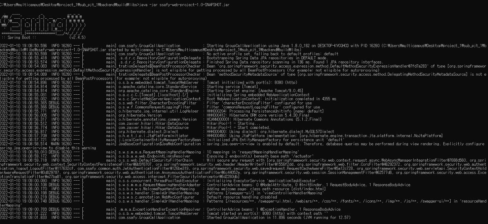
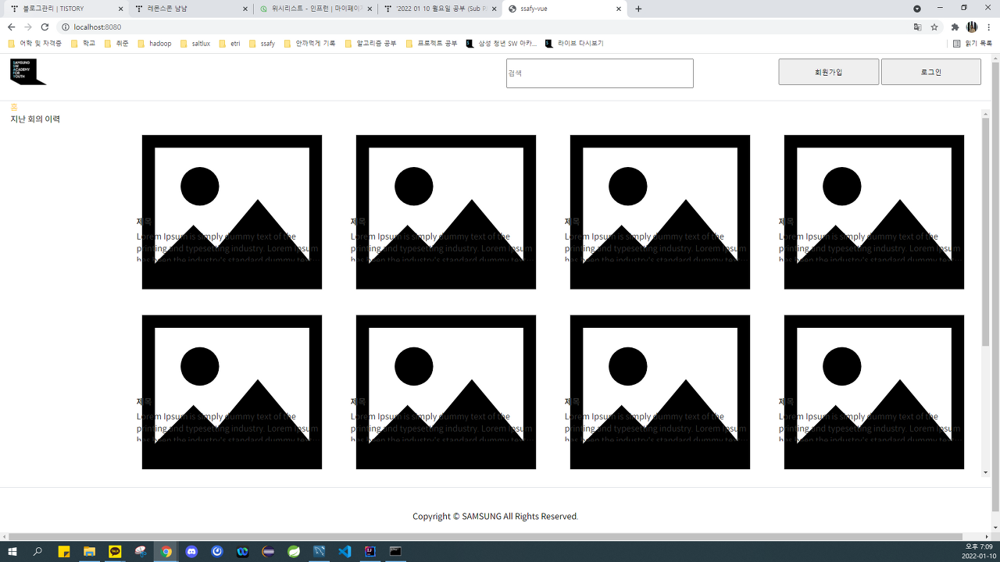

# 제목 없음

### **백엔드 / 프론트엔드**

**Java** ~~Open JDK 1.8.x ([https://github.com/ojdkbuild/ojdkbuild](https://github.com/ojdkbuild/ojdkbuild))~~ Zulu-8

**MySQL** ~~5.7.x ([https://downloads.mysql.com/archives/installer/](https://downloads.mysql.com/archives/installer/))~~ 8.0.26

**Eclipse** ~~IDE 2020-06 R Package Enterprise Java Developers~~ 2018-09, ~~Spring Tool 3, Lombok~~

**IntelliJ IDEA Community**

- build.gradle 수정
- applicaton.properties 수정 (id=ssafy, pw=ssafy)
- clone 한 스켈레톤 코드에서, backend-java 디렉토리 이름을 backend로 바꿔줌
localhost:8080/ 을 호출 잘 됨
- localhost:8080/swagger-ui/ 호출 잘 됨

**Node JS**

**VS Code**

- npm install, npm run serve
- postcss received undefined instead of css string 에러 해결 : 
npm install node-sass, npm rebuild node-sass

### **프론트엔드 빌드**

생성경로 : /backend/main/resources/dist

### **통합 빌드 및 실행**

- 프론트엔드 프로젝트와 백엔드 프로젝트 전체를 통합 빌드
- 클론한 레파지토리의 /backend 경로에서 gradlew clean build 명령어 실행
- backend/build/libs 경로에 .jar 파일이 생성
- 통합 빌드 된 Spring Boot Applicaton 구동을 위해, 
java -jar ssafy-web-project-1.0-SNAPSHOT.jar 명령어 실행
- 프로젝트 구동 정상적으로 진행 확인 및 localhost:8080/ 에 접속하여 
서비스 구동 확인프로젝트 구동 정상적으로 진행 확인

