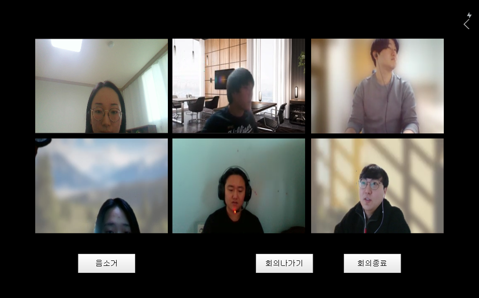

# 20220112_와이어프레임

- 화상채팅 페이지(실제 회의가 이루어지는 화면) 와이어프레임 만드는 것을 맡았다
- 회의 기법에 따라 화면 구성이 다를 수 있기 때문에 일반, 3룸 기법, 6모자 기법 중 일반 회의실과 3룸 기법이 적용된 회의실을 만들었다

## 일반 회의실

1. **기본 화면**
    
    
    
2. **채팅 열었을 때**
    
    .png)
    

1. **회의록 열었을 때**
    
    .png)
    

## 3룸 기법이 적용된 회의실

1. **몽상가의 방**
    
    .png)
    
2. **현실가의 방**
    
    .png)
    
3. **비평가의 방**
    
    .png)