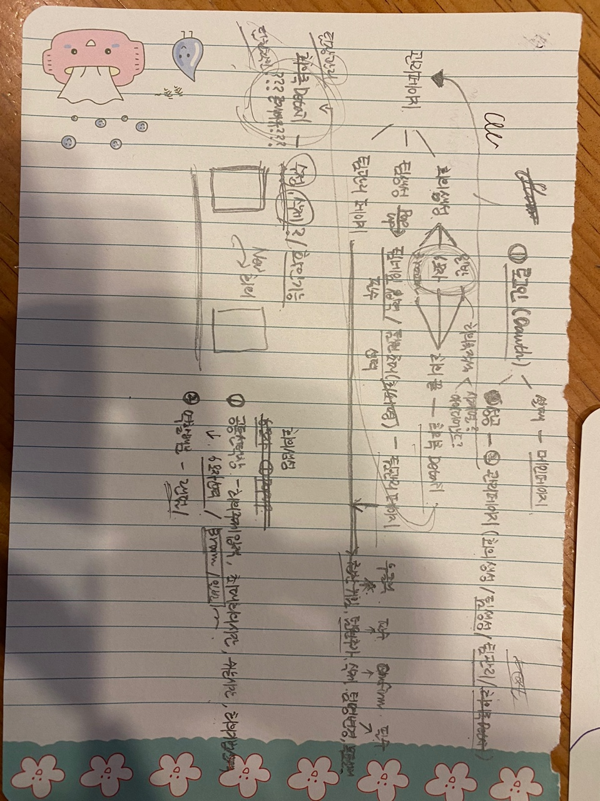
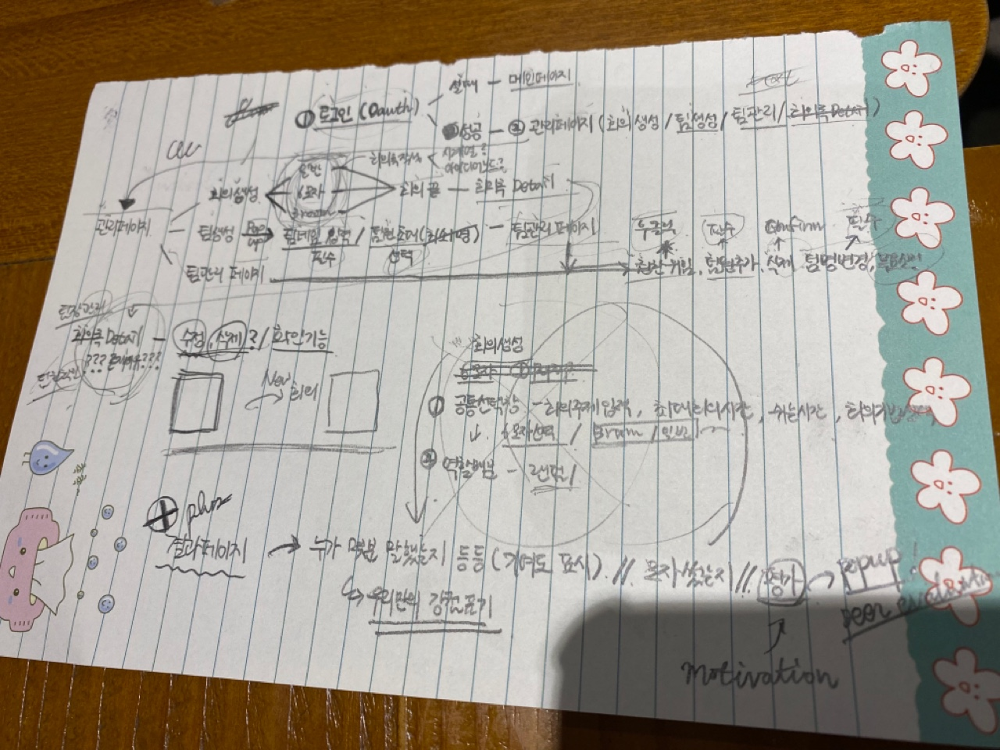
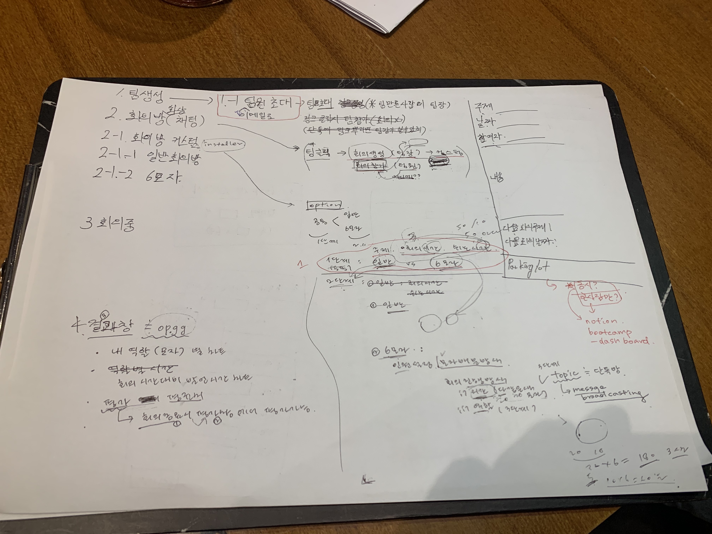
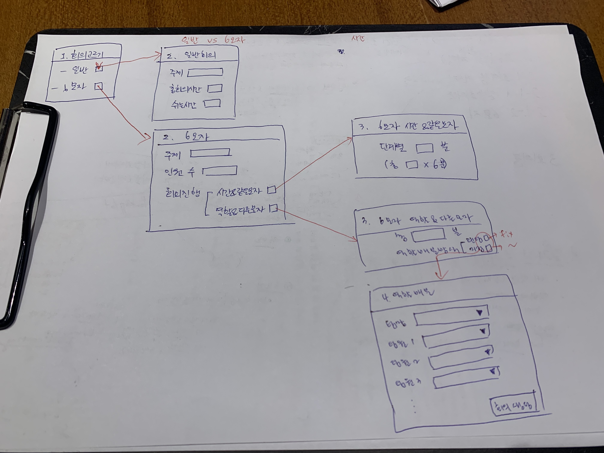

# 20220113_컨설팅및기획리뷰

## 컨설팅 내용

1. 유저풀, 커버리지
해당 회의 기법이 모든 회의 어젠더에 다 사용되는 기법이냐?
유저풀이 줄어들 위험성이 있냐?
커버리지가 작은것 같은데 알고 있는지?
(예 : 우리 회사는 아이디어 회의 잘 안하는데? 안써도 될거같은데?)
대학생으로 고정하지 않고 아이디어 회의를 하고 싶은 사람들로 유저풀을 설정할 수 있다
2. 장점
엔터테이먼트가 아닌데 흥미 유발이라고 기재된 장점은 재고할 필요가 있는게 아니냐?
3. 시스템
너무 수동적으로 배정되는 게 아니고 (랜더링만 해주는게 아니고)
사용자들이 6모자 기법을 잘 활용할 수 있도록 도와줘야 한다
(예 : 너는 빨간모자를 썼을 때 더 효과가 좋은 것 같아 너 빨간모자 우선적으로 써)
4. skelton code
차주 계속 이어감
사용 비추
5. 와이어프레임 리뷰
회의록 - 회의록 후순위
회의 생성 방법 - 회의 생성 방법 수정
팀 만들기 - 팀은 자동으로 초청해서
마이페이지 - 자기가 속한 팀정도 보여줌, 자기 정보, 타겟층 명확히 설정 or 확장을 고려
6모자 - 6모자 추가기능이 없냐 생각해보기
(예 : 빨간 모자가 너무 시끄러우면 경고 맥임)
6. 와이어프레임 툴 추천
Figma / Framer
7. 우선순위
6모자 --> 일반 --> 3룸
6모자만 있으면 너무 유저풀이 작은 것 같다
단 일반 채팅도 뭔가 좀 다른게 있어서 일반 회의에서도 적용할 수 있는 기능이 있으면 좋겠다
주제를 무조건 입력, 최대시간 쉬는시간 입력해서 시간적 압박 ... 등등
요즘 트랜드가 회의시간이 너무 길다 너무 비효율적이다 라는거니 이런거에 대한 방안을 마련해보길

## 기획 리뷰

만든 와이어프레임을 바탕으로 서비스 플로우차트? 만들기

