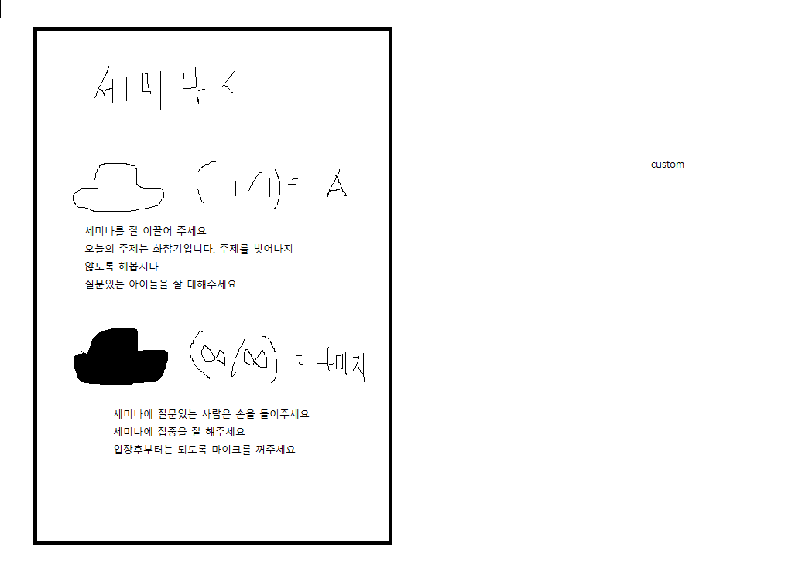
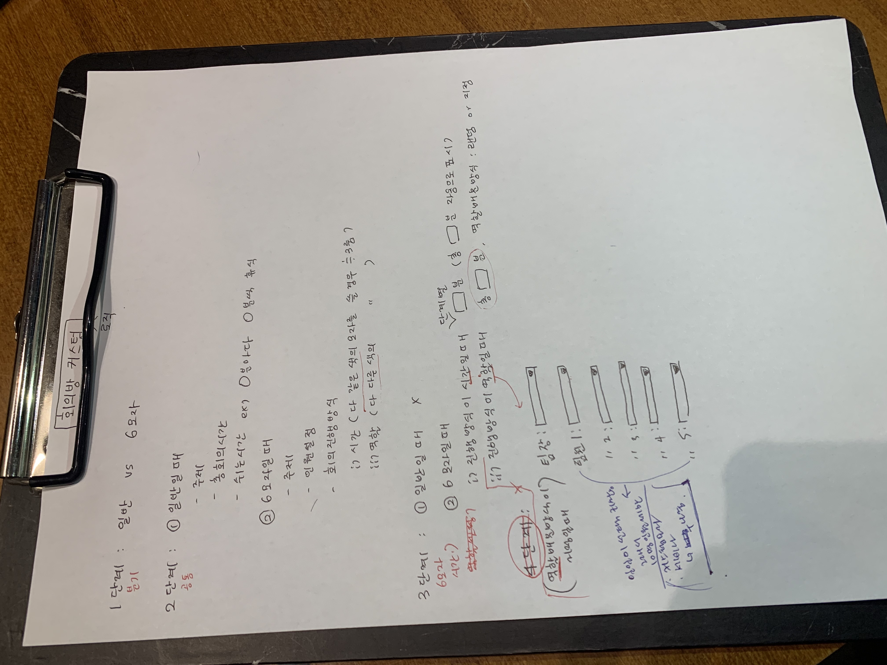

## 0110

- 백신 접종으로 인한 공가


## 0111

- 웹 화상채팅 기능에 추가할 회의 기법 선정

  - KJ기법 - 친화도 분석법 : 유진주

    - BottomToTop기법으로 작은 기능들을 나열, 공통 분모로 묶어서 올라가서 최종적인 주요 기능을 찾는 기법
    - 창의적인 아이디어 생산을 위한 기법
    - 장점
      1. 우선순위 설정이 용이
      2. 다수 의견 반영하기 때문에 객관적
    - 단점
      1. 구현 문제 > 자유로운 UI를 제공해야 유용하게 쓸 수 있다. 
      2. 짧은 회의를 지향하는 기법이지만 생각보다 오래 걸린다.(내 경험)

    > 결론 : 주제와 조금 벗어나는 것 같다는 의견이 다수, 미선택

  - 여섯 색깔 모자 기법 : 박상훈

    - 에드워드 드 보노가 개발한 발상법으로 평등한 발언권을 가진 사람들이 각 모자에 따라 역할을 나누어 진행하는 기법
    - 초록 : 창조 / 노랑 : 긍정적 사고 / 빨간 :  감정, 본능적 사고 / 검정 : 비판, 적부의 판단 / 하얀 : 객관, 중립 / 파란 : 사고, 요약, 결정
    - 장점
      1. 아이디어 개발에 효율을 높이고 능률적으로 진행할 수 있다.
      2. 시각적인 효과로 역할 구분을 명확히 할 수 있다.
    - 단점
      1. 사람 수에 따른 인원 배분 문제.
      2. 시각적인 효과를 확실히 줄 수 있는 방법을 찾아야 한다.

    > 결론 : 처음에 선택했던 기법이기도 하고 좋은 평을 받아 선택

  - PMI : 박상훈

    - 에드워드 드 보노 개발
    - Plus / Minus / Interest 시각으로 보는 기법
    - 여섯 색깔 모자 기법의 하위 호환으로 생각이 든다.

    > 결론 : 여섯 색깔 모자 기법으로 선택했으니 패스

  - SCAMPER : 박상훈

    - Substitute(대체) / Combine(결합) / Adapt(변경) / Modify(수정) / Put to other purpose(타 용도 전환) / Eliminate(제거) / Reverse(순서 바꾸기)로 역할 구분 또는 시간 구분하여 진행
    - 장점
      1. 다양한 시각과 자세한 역할 구분으로 도움이 될 것
    - 단점
      1. 역할을 구분하는데 조금은 추상적임

    > 결론 : 추상적인 문제로 패스

  - 브레인스토밍 : 이남수

    - 아이디어 도출에 유명한 기법
    - 많은 아이디어를 선별하지 않고 내어 좋은 아이디어 창출
    - 장점
      1. 많은 아이디어를 창출할 수 있다.
    - 단점
      1. 제시된 아이디어를 선별하는 과정을 거쳐야 한다.

    > 결론 : 간단하고 강력한 툴이지만 평이한 기능, 하지만 결국 어떤 회의에서 선제되어야하는 기법이라고 생각. 보류

  - 피시본 토의 기법 : 박주윤

    - 일의 결과(특성)와 그것에 영향을 미치는 원인(요인)을 계통적으로 정리, 원인 규명을 쉽게 할 수 있도록 하는 원인분석기법
    - 생선 머리 : 일의 예상 결과 / 뼈 : 결과에 영향을 미치는 원인
    - 문제 해결 도출할 수 있는 회의 기법
    - 장점 
      1. 집단지성을 이용한 효과 극대화
      2. 원인에 대한 적극적 탐색
      3. 토론의 주제 명확
    - 단점
      1. 자료 수집이 선행되어야 하는 경우 다반사
      2. 연관이 많이 걸려있는 복잡한 문제는 유용하지 않음
      3. 구현에서 UI 자유도를 주기 위한 부하가 걱정

    > 결론 : 사용처가 분명하여 사장될 수 있는 기능으로 보임, 패스

  - 피라미드 토론기법

    - 1인 팀에서 토너먼트 방식으로 아이디어를 합쳐가는 기법
    - 의사 결정을 설득하는 구조로 선택함
    - 장점
      1. 거르고 거르는 구조로 의견을 선별하는 것에 유리
      2. 다수가 진행할 수 있는 기법
      3. 최선의 결과를 예측할 수 있음
    - 단점
      1. 토론 시간이 오래걸림
      2. 구현하는 과정에서 수렴한 의견 데이터를 위로 올리는 과정이 복잡할 것으로 예상
      3. 부전승 고려
      4. 관리에 곤란할 부분이 많을 것으로 예상

    > 결론 : 짧은 시간에 구현하기에는 힘들 것으로 예상

- react / vue의 선택 : frontend 기술로는 React 선정

  - Vue2와 Vue3의 차이를 극복하는 것이 좋을까? or React를 새로이 공부하는 것이 더 좋을까? 
  - React 선정 이유
    1. 전자와 후자가 거의 비슷한 노력이 필요할 것이라고 생각이 든다.
    2. 우세종이라고 판단이 되는 React를 익혀두는 것이 꽤 큰 강점이 될 것이라고 생각이 든다
  - React는 어떻게 공부를 할 것인가?
    1. inflearn에서 제공하는 강의를 찾자
    2. 생활코딩에서 제공하는 inflearn강의를 사용해서 듣고 기본적인 베이스를 쌓자
       - React 기초강의 : https://www.inflearn.com/course/react-%EC%83%9D%ED%99%9C%EC%BD%94%EB%94%A9/dashboard
       - React 기본강의 : https://www.inflearn.com/course/react-class-function-%EC%83%9D%ED%99%9C%EC%BD%94%EB%94%A9
       - 추가적인 강의(Redux) : https://www.inflearn.com/course/redux-%EC%83%9D%ED%99%9C%EC%BD%94%EB%94%A9

- 좋은 회의가 무엇일까?라는 고찰
  - 짧은 회의 시간
    - 20-10 회의법 : 20분 회의 / 10분 휴식 
    - 타임 키퍼기능으로 커버할 수 있지 않을까?
  - 명확한 회의주제
    - 미리 회의주제를 선정해 회의방에 설정해주는 기능
    - 회의주제를 화면에 잘 보이도록 위치시켜주자
  - 명확한 Action
    - 어떤일을 언제, 어떤 아웃풋을 날지 명확히하자
    - 회의록을 실시간으로 작성할 수 있도록 기능을 추가해볼까?
  - 회의의 집중
    - 집중하지 못하는 참여자에게 알림?
  - 손들기, 이모지 등등 기능은?


## 0112

- 와이어 프레임 개인 제작 및 스타일링 선정

  - 여섯 색깔 모자 기법을 담당하여 제작
  - 1안 : 구현의 어려운 점이 있지만 가시성 높은 안

  

  - 2안 : 구현의 난이도와 가시성 절충, 깔끔함이 더 있음

  

  - 개선점
    1. 역할에 따른 배경색 변경
    2. 아이디어 보드 추가버튼(Brain Storming, 간략 회의록)
  - 전체적인 스타일링
    1. 어두운 배경으로 가시성 고려, 사용자의 눈의 피로를 덜 수 있는 배경색 선택
    2. 배경색을 통해서 역할 구분에 명확성을 더할 수 있는 방법 고려
  - 추가적인 스타일링을 계속해서 고민해볼 것
  - 로고 제작 고려

- React 개인 학습

  - React 공부 인증

  

  - React사용을 위한 설치와 환경설정

  - React 내에서 Javascript, HTML, CSS 기초 동작법

  - Component 구성하고 분리하는 방법

  - state와 props에 대한 내용
  
    - App.js
  
    ``` react
    import React, { Component } from 'react';
    import TOC from './components/TOC.js';
    import Content from './components/Content.js';
    import Subject from './components/Subject.js';
    import './App.css';
    ```
  
    > - TOC, Content, Subject를 한 파일에서 작성한 후 파일로 나누며 적용시킨 import
  
    ``` react
    class App extends Component {
      constructor(props){
        super(props);
        this.state = {
          mode: 'welcome',
          subject: {
            title: 'WEB',
            sub: 'World Wide Web!'
          },
          welcome: {
            title: 'Welcome',
            desc: 'Hello, React!!'
          },
          contents: [
            {id:1, title: 'HTML', desc: 'HTML is for information'},
            {id:2, title: 'CSS', desc: 'CSS is for design'},
            {id:1, title: 'JavaScript', desc: 'JavaScript is for interactive'},
          ]
        }
      }
    ```

    > - state를 사용
    > - 통합하여 관리해야 하는 자료들은 상단에 데이터를 저장하여 내려주는 방식을 채택하여야 한다.
    > - component로 틀을 구상해놓고 필요한 곳에서 데이터를 제어하여 페이지를 구성하는 방법을 고려하는 것을 습관처럼 여기도록 연습해야 한다.
  
    ``` react
      render() {
        var _title, _desc = null;
        if(this.state.mode === 'welcome'){
          _title = this.state.welcome.title;
          _desc = this.state.welcome.desc;
        } else if(this.state.mode === 'read') {
          _title = this.state.contents[0].title;
          _desc = this.state.contents[0].desc;
        }
        return (
          <div className="App">
            <Subject 
              title={this.state.subject.title} 
              sub={this.state.subject.sub}
            >
            </Subject>
            <TOC data={this.state.contents}></TOC>
            <Content title={_title} desc={_desc}></Content>
          </div>
        );
      }
    }
    
    export default App;
    ```
  
    > - 조건 분기를 통한 페이지 변경 방법은 javascript문법을 사용하여 작성하면 된다.
    > - 각 component에 데이터를 보내는 방법은 HTML 내 속성 태그를 사용하는 방법으로 전달할 수 있다.
  
    - Subject.js
  
    ``` react
    import React, { Component } from 'react';
    
    class Subject extends Component {
      render(){
        return (
          <header>
            <a href="" onClick={function (e) {
              console.log(e);
              e.preventDefault();
              this.setState({
                mode: 'welcome'
              });
            }.bind(this)}>{this.props.title}</a>
            {this.props.sub}
          </header>
        );
      }
    }
    
    export default Subject;
    ```
  
    > - 이벤트 핸들러 공부하는 과정에서 멈춘 코드로 오류가 있다
    > - this를 사용하기 위해서는 .bind()가 필요하다. < Vue의 v-bind와 비슷
  
    - TOC.js
  
    ``` react
    import React, { Component } from 'react';
    
    class TOC extends Component {
      render() {
        var lists = [];
        var data = this.props.data;
        var i = 0;
        while(i < data.length) {
          lists.push(<li key={data[i].id}><a href={"/content/" + data[i].id}>{data[i].title}</a></li>);
          i = i + 1;
        }
    
        return (
          <nav>
            <ul>
              {lists}
            </ul>
          </nav>
        );
      }
    }
    
    export default TOC;
    ```
  
    - Content.js
  
    ``` react
    import React, { Component } from 'react';
    
    class Content extends Component {
      render () {
        return (
          <article>
            <h2>{this.props.title}</h2>
            {this.props.desc}
          </article>
        );
      }
    }
    
    export default Content;
    ```
  
  - React를 공부하면서 느낀 점
  
    - Vue보다 직접 제작하고 만드는 것이 더 많아서 복잡할 것 같다는 점.
    - 복잡한 만큼 자유도는 높을 것으로 예상된다.
    - HTML, CSS, js가 분리가 되어 있지 않고 한눈에 구분이 되지 않는다는 점이 어려운 점으로 다가올 것으로 예상된다.
    - Vue의 Vuex와 같은 여러 툴은 어떻게 적용하는지 적용하는 부분에 대한 난이도가 걱정된다.

## 0113

- 2차 컨설팅 : 회의 기법에 대한 논의와 세부 기능들의 구현 여부 논의

- 회의록

  - 와이어프레임 작성
     - Figma / Framer
   - 6모자기법의 허들
      - 모자 배정의 문제
      - 모자가 뭐지?라고 생각할 수 있다
      - 역할을 바꿀 수 있도록 버튼
      - 아이디어 도출에만 치중되는 느낌이 있다.
      - 유저 풀이 급감하는 느낌이 있다 > 죽은 기능이 되어버리는 것도 감안할 것인지 고민해봐라
      - 장점에 대해서 조금 더 생각해봐라
      - 장점을 화상채팅에서 적용해서 극대화할 수 있는 것을 찾아라
      - 누구는 어떤 모자가 더 어울려 / 누구는 어떻게 생각하더라 를 찾을 수 있는 유저 평가 기능
      - 없는 기능이지만 더 잘되게 할 수 있는 서브기능이 있다면??을 고민해봐라
      - 조금 평범한 컨텐츠가 될 가능성이 보인다. 더 살릴 수 있는 기능을 찾아봐라

  - 차주 스켈레톤 코드 
     - 이어간다.

  - 새로운 프로젝트 파서 구현하는 게 시간 차이  
     - 더 걸릴 수 밖에 없다. 
     - But, 스켈레톤 코드를 비추한다. 스파게티 코드될 가능성 큼
     - 소스 반출하는데 너무 어렵다.

  - 기능 고려 시 필수적으로 고려하는 점
     - 장점을 얼마나 잘 녹일 수 있는가?에 대해서 연구해봐라
     - 직접 사용해보고 장단점을 찾아서 부각하고 커버할 수 있도록 구상해보자

  - 회의록 게시 및 수정 기능
     - 회의록을 쓰는 것에 대한 니즈 찾아라
     - 커버할 수 있는 기능이 있다면 OK, 아니라면 NO / 6개의 모자별 sort해줄 수 있는가?

  - 유저 프로필
     - 회사, 대학생, 유저 풀을 넓게 할 수 있도록 통합 프로필 or 회원정보페이지를 구상해봐라
     - 타게팅을 생각할 것인지 확장을 고려한 설계를 할 것인지 고민해봐라

  - 우선순위 > 회의를 잘 못하는 사람을 도와줘!라는 기조를 전반부에 적용해라
    <시간이 짧은 회의, 주제가 명확한 회의, 액션이 명확한 회의> 남수 생각 좋음!ㅎㅎ
    말을 안하는 사람을 하게끔 만드는 기능?
     - 6모자기법
     - 일반채팅 >>> 했으면 좋겠다 / 1,2번을 잘만들래?라는 생각
     - 3 room

- 피드백

  - 유저 풀이 줄어드는 느낌이 든다 : 6모자기법이 아이디어 창출에만 쓰이는 기법이지 않을까?
  - 아이디어 창출에서 작동하는 기법이 솔루션을 내는 과정에 적용할 수 있다.
  - 다양한 상황에서도 사용될 수 있음을 논리적으로 설득할 수 있을 것으로 예상된다.

- 여섯 색깔 모자 기법에 대한 발전 : 단점을 어떻게 커버하고 장점을 부각할 것인가?

  - 6룸

    참여자가 모두 같은 모자를 쓰고 회의를 진행하며, 일정시간마다 모자를 바꿔쓰며 단계를 진행한다.

    단계를 중복진행할 수 있으며, 단계를 생략할 수 있다.

  - 라운드 적용

    일정 시간마다 참여자들의 역할을 바꿔 회의 진행

  - 모자의 역할 커스텀

    모자의 역할을 커스텀할 수 있게 한다. - 세미나 / 강연 등 다른 회의형식에서 상황에 맞는 역할을 부여할 수 있다.

    

- 피드백을 반영하며 새롭게 flowchart와 조건 분기점 작성

  

- 회의 생성하는 과정의 flowchart와 조건 분기점

  
