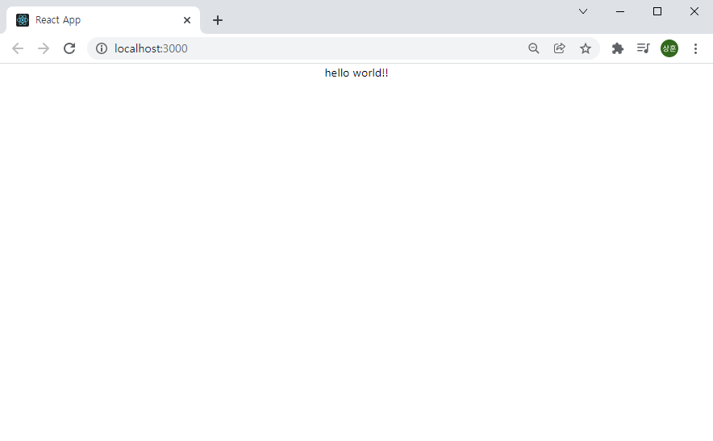
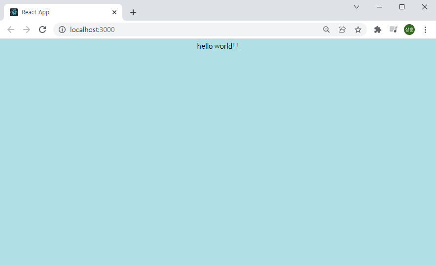
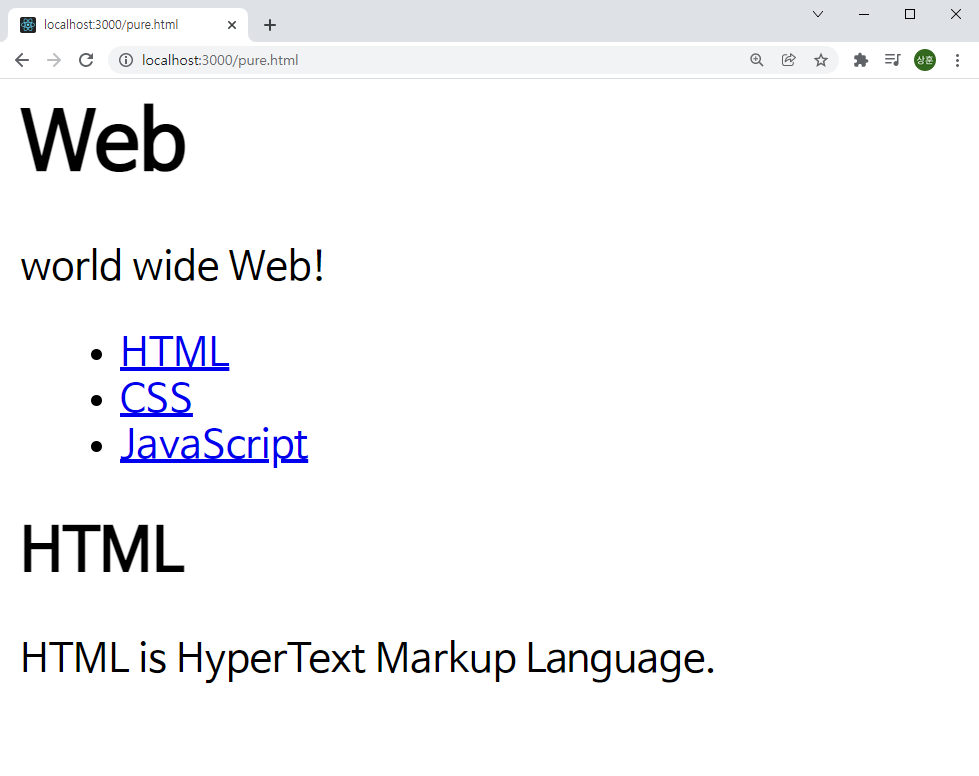
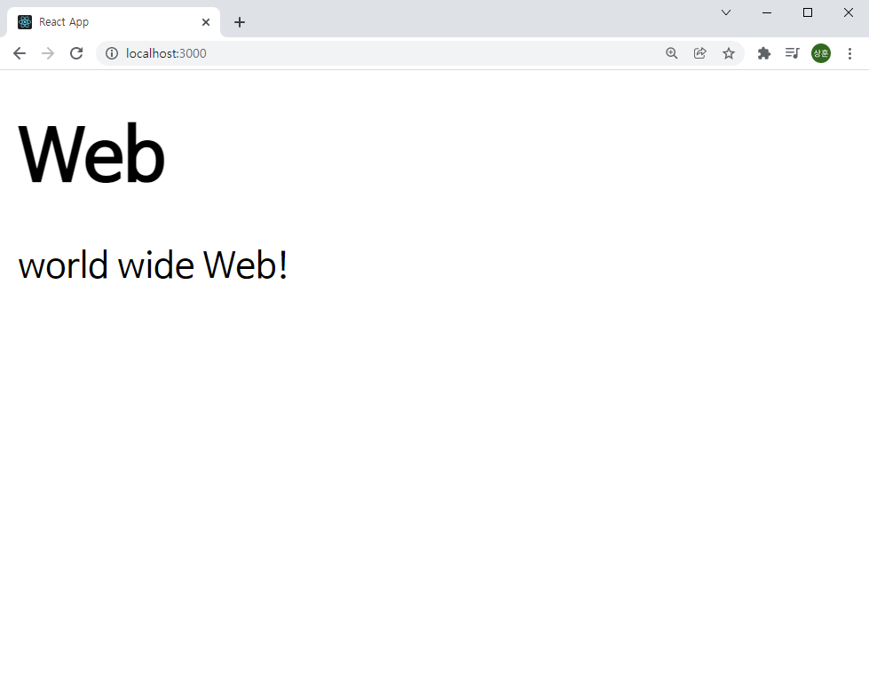
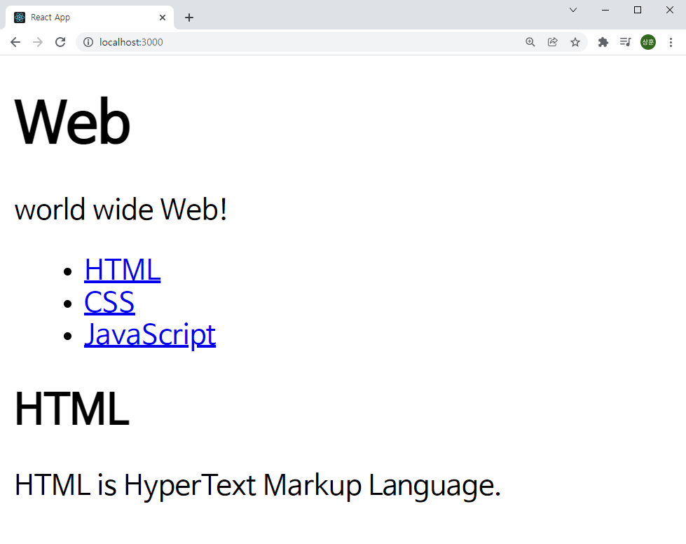
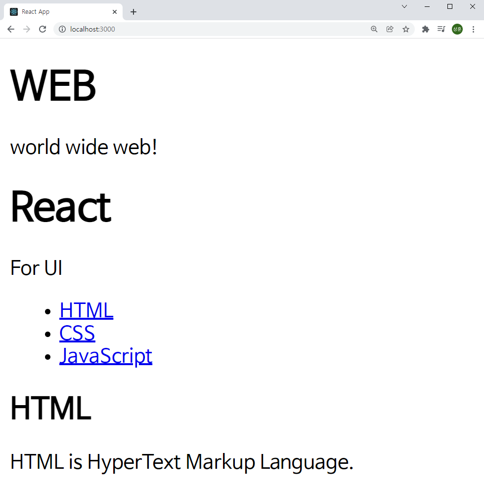
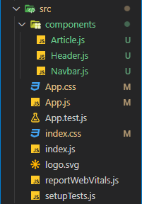

## React

우리는 Vue.js를 사용하는 대신, 현재 프론트엔드 분야에서 가장많이 사용되는 React로 제작하기로 결정하였다. 그를 위해서 React에 대해 공부해 보는 시간을 가지게 되었다.

참조 : [생활코딩-React](https://www.youtube.com/playlist?list=PLuHgQVnccGMCRv6f8H9K5Xwsdyg4sFSdi)


### 시작하기

먼저 npm을 이용하여 `create-react-app`을 설치해야 한다.

이 [링크](https://nodejs.org/ko/)에서 node.js를 다운 받아 설치하고 시작하자.

```bash
npm -v
```

위 명령어를 `bash`에 입력하여 설치가 완료되었는지 확인한다.

```bash
npm install -g create-react-app
```

위 명령어를 입력하여 `create-react-app`을 설치한다. `-g`는 이 컴퓨터의 모든 환경에 설치한다는 뜻이다. 가상환경을 사용한다면 입력하지 않아도 된다.


### 새로운 React 앱 만들기

React 앱을 만들고자 하는 디렉토리로 이동하여 아래와 같은 명령어를 입력한다.

```bash
npm create-react-app react-app
cd react-app
npm start
```

성공적으로 작업하였다면 아래와 같은 화면이 나올 것이다.


### JavaScript

#### index.html

```html
	
	...

<body>
  <noscript>You need to enable JavaScript to run this app.</noscript>
  <div id="root"></div>
</body>

	...

```

이 부분을 찾을 수 있다. 이것이 의미하는 것은 화면에 보여지는 `index.html`의 body id가 'root'인 컴포넌트가 존재한다는 뜻이다. 이를 `index.js`에서 조작할 수 있다.


#### index.js

```javascript
import React from 'react';
import ReactDOM from 'react-dom';
import './index.css';
import App from './App';
import reportWebVitals from './reportWebVitals';

ReactDOM.render(
  <React.StrictMode>
    <App />
  </React.StrictMode>,
  document.getElementById('root')
);

// If you want to start measuring performance in your app, pass a function
// to log results (for example: reportWebVitals(console.log))
// or send to an analytics endpoint. Learn more: https://bit.ly/CRA-vitals
reportWebVitals();

```

여기서도 마찬가지로 `root`컴포넌트에 `App.js`로 조작된 컴포넌트를 입력시켜 줄 수 있다.


#### App.js

```javascript
import logo from './logo.svg';
import './App.css';

function App() {
  return (
    <div className="App">
      <header className="App-header">
        
        <p>
          Edit <code>src/App.js</code> and save to reload.
        </p>
        <a
          className="App-link"
          href="https://reactjs.org"
          target="_blank"
          rel="noopener noreferrer"
        >
          Learn React
        </a>
      </header>
    </div>
  );
}

export default App;

```

그렇기 때문에 위 코드를 아래와 같이 바꿔준다면

```javas
import './App.css';

function App() {
  return (
    <div className="App">
		hello world!!
    </div>
  );
}

export default App;

```



이처럼 조작할 수 있다.


### CSS

#### index.css

```css
body {
  margin: 0;
  font-family: -apple-system, BlinkMacSystemFont, 'Segoe UI', 'Roboto', 'Oxygen',
    'Ubuntu', 'Cantarell', 'Fira Sans', 'Droid Sans', 'Helvetica Neue',
    sans-serif;
  -webkit-font-smoothing: antialiased;
  -moz-osx-font-smoothing: grayscale;
}

code {
  font-family: source-code-pro, Menlo, Monaco, Consolas, 'Courier New',
    monospace;
}
```

초기에는 위와 같이 설정되어 있다. 이를 

```css
body{
  background-color: powderblue;
}
```

위 처럼 수정한다면 아래와 같이 변경됨을 알 수 있다.




### 배포

로컬에서 React를 실행하는 것과 같이 배포할 때도 똑같이 하게 된다면 React개발자용 파일과 같이 용량이 커지고 보안상의 문제가 발생할 수 있다. 이를 막기위해 다음과 같은 작업을 수행한다.

```bash
npm run build
```

이 명령어로 배포용 `build`를 생성해 준다. 그리고 서버로 배포하기 위해 다음과 같은 명령어를 입력한다.

```bash
npm install -g serve
serve -s build
```


### Component

먼저 만들고자하는 문서를 html로 만들어 보자

```html
<!-- pure.html -->

<html>
  <body>
    <header>
      <h1>Web</h1>
      world wide Web!
    </header>

    <nav>
      <ul>
        <li><a href="1.html">HTML</a></li>
        <li><a href="2.html">CSS</a></li>
        <li><a href="3.html">JavaScript</a></li>
      </ul>
    </nav>
    
    <article>
      <h2>HTML</h2>
      HTML is HyperText Markup Language.
    </article>
  </body>
</html>
```

위와 같은 코드를 실행한다면 아래와 같은 모습의 웹페이지를 기대할 수 있다.



이를 컴포넌트를 이용해 바꾸어 보자.


#### Header

App.js의 코드를 다음과 같이 변경해 보자.

```javascript
class Header extends Component {
  render () {
    return (
      <header>
        <h1>Web</h1>
        world wide Web!
      </header>
    );
  }
}

class App extends Component {
  render () {
    return (
      <div className="App">
        <Header/>
      </div>
    );
  }
}

```

`Subject`라는 클래스 함수를 생성하여 기존의 html에서 header부분을 렌더링 하도록 만들자. 그리고 그 `Subject` 클래스 함수를 `App` 클래스 함수에서 렌더링 할 수 있도록 해주면 다음과 같은 결과를 만들 수 있다.




#### Navbar

```javascript
class Navbar extends Component {
  render () {
    return (
      <nav>
        <ul>
          <li><a href="1.html">HTML</a></li>
          <li><a href="2.html">CSS</a></li>
          <li><a href="3.html">JavaScript</a></li>
        </ul>
      </nav>
    );
  }
}
```


#### Article

```javascript
class Article extends Component {
  render () {
    return (
      <article>
        <h2>HTML</h2>
        HTML is HyperText Markup Language.
      </article>
    );
  }
}
```


#### App

```javascript
class App extends Component {
  render () {
    return (
      <div className="App">
        <Header/>
        <Navbar/>
        <Article/>
      </div>
    );
  }
}
```

마찬가지로 각 클래스를 생성하고 `App`클래스를 수정해 주면 html로 작성한 화면과 동일한 페이지를 얻을 수 있다.



### Props

`App`에서 각 클래스의 값을 변경시켜 주어 사용하고 싶다. 이러한 경우 사용하는 것이 `Props`이다.

```javascript
class Header extends Component {
  render () {
    return (
      <header>
        <h1>{this.props.title}</h1>
        {this.props.sub}
      </header>
    );
  }
}

class App extends Component {
  render () {
    return (
      <div className="App">
        <Header title="WEB" sub="world wide web!"/>
        <Navbar/>
        <Article/>
      </div>
    );
  }
}
```


위와 같이 변경하여도 같은 결과 값이 나올 것이다. 만약 `App`클래스를 다음과 같이 변경한다면

```javascript
class App extends Component {
  render () {
    return (
      <div className="App">
        <Header title="WEB" sub="world wide web!"/>
        <Header title="React" sub="For UI"/>
        <Navbar/>
        <Article/>
      </div>
    );
  }
}
```



이러한 결과를 얻을 수 있다.


### Component 파일로 분리하기

이렇게 작성을 하게 되면 `App.js`파일에 작성된 내용이 너무 많아진다. 그리고 기능적으로 다른 컴포넌트들이 한꺼번에 있어 알아보기도 쉽지 않고 유지 보수가 힘들어진다. 이를 위해서 컴포넌트 폴더를 따로 생성하여 분리시켜 준다.




그리고 각 파일들을 이렇게 작성해 준다.

#### Header.js

```javascript
import React, { Component } from 'react';


class Header extends Component {
  render () {
    return (
      <header>
        <h1>{this.props.title}</h1>
        {this.props.sub}
      </header>
    );
  }
}

export default Header;
```


#### Navbar.js

```javascript
import React, { Component } from 'react';


class Navbar extends Component {
  render () {
    return (
      <nav>
        <ul>
          <li><a href="1.html">HTML</a></li>
          <li><a href="2.html">CSS</a></li>
          <li><a href="3.html">JavaScript</a></li>
        </ul>
      </nav>
    );
  }
}

export default Navbar;
```


#### Article.js

```javascript
import React, { Component } from 'react';


class Article extends Component {
  render () {
    return (
      <article>
        <h2>{this.props.title}</h2>
        {this.props.desc}
      </article>
    );
  }
}

export default Article;
```


#### App.js

```javascript
import React, { Component } from 'react';
import Header from "./components/Navbar"
import Navbar from "./components/Navbar"
import Article from "./components/Navbar"
import './App.css';


class App extends Component {
  render () {
    return (
      <div className="App">
        <Header title="WEB" sub="world wide web!"/>
        <Navbar/>
        <Article title="HTML" desc="HTML is HyperText Markup Language."/>
      </div>
    );
  }
}

export default App;

```

이렇게 분리 시켜 준다면 한 기능에 오류가 생기거나 수정할 사항이 발생했을 때 기능이 얽히지 않아 유지 보수가 매우 편리해 진다.


### State

앱이 내부적으로 사용하는 구조를 갖기 위해서 상위 컴포넌트의 `state`를 하위 컴포넌트의 `props`로 데이터를 전달해 준다. 아래와 같이 수정해 줄 수 있다.

```javascript
// App.js

class App extends Component {
  constructor(props) {
    super(props);
    this.state = {
      header:{title:'WEB', sub:'World Wide Web!'}
    }
  }
  render () {
    return (
      <div className="App">
        <Header 
          title={this.state.header.title}
          sub={this.state.header.sub}
        />
        <Navbar/>
        <Article title="HTML" desc="HTML is HyperText Markup Language."/>
      </div>
    );
  }
}

```


### Key

`Navbar`도 변경해 보자. 리스트로 여러가지의 데이터를 받고 있기 때문에 주의해야 할 점이 있다. 각 리스트에 `key`값을 주어 React 내부에서 처리가 원활하도록 하자.

```javascript
// App.js

class App extends Component {
  constructor(props) {
    super(props);
    this.state = {
      header:{title:'WEB', sub:'World Wide Web!'},
      articles:[
        {id:1, title:'HTML', desc:'HTML is HyperText Markup Language.'},
        {id:2, title:'CSS', desc:'CSS is for desgin.'},
        {id:3, title:'JavaScript', desc:'JavaScript is for interactive.'},
      ]
    }
  }
  render () {
    return (
      <div className="App">
        <Header 
          title={this.state.header.title}
          sub={this.state.header.sub}
        />
        <Navbar data={this.state.articles}/>
        <Article title="HTML" desc="HTML is HyperText Markup Language."/>
      </div>
    );
  }
}

// Navbar.js

class Navbar extends Component {
  render () {
    var lists = [];
    var data = this.props.data;
    var i = 0;
    while(i < data.length) {
      lists.push(<li key={data[i].id}><a href={"/content/"+data[i].id}>{data[i].title}</a></li>);
      i = i + 1;
    }
    return (
      <nav>
        <ul>
          {lists}
        </ul>
      </nav>
    );
  }
}
```

