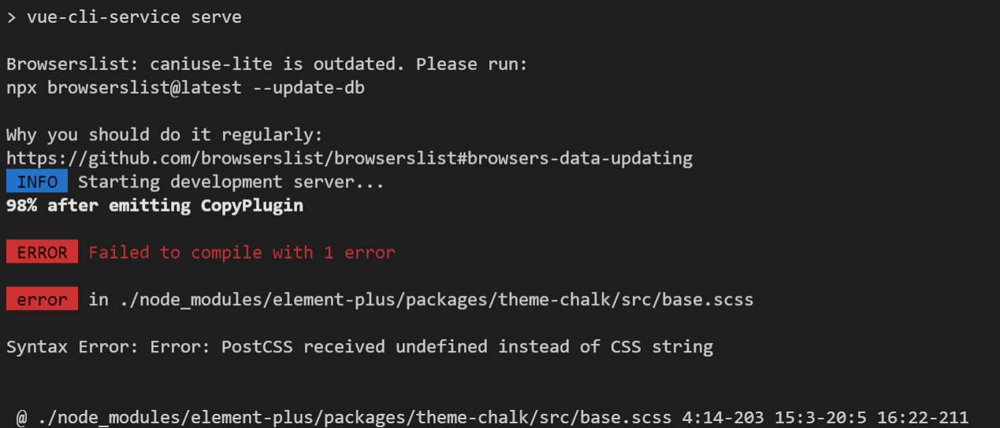

### mysql 환경변수 설정하는 법

- https://m.blog.naver.com/PostView.naver?isHttpsRedirect=true&blogId=jin93hj&logNo=221118160512

### 폴더의 경로로 cmd 켜기


- 폴더의 경로창을 클릭한 후 cmd 를 작성한다.


---


명세서에 나와있는데로 진행을했는데 파일명이 backend-java 로 되어있어서

빌드가 새롭게 backend 폴더로 되어서 문제가 발생합니다...

그래서 폴더명을 다시 변경해 주면


생전처음 스프링본 모습!!


행복하게 잘 작동하는 모습을 볼 수 있다.

---

프론트엔드 부분도 아래와 같이 역시 문제가 발생해서 찾아보니



```
npm rebuild node-sass
```

라는 명령어를 치고 빌드를 시작하자


잘 빌드되어 백엔드의 빌드 libs폴더로 잘 생성되었다.

다만 조금 생소했던 부분은

```
npm run serve 
```

를 하기 전에도 백엔드에서 본 모습과 프론트의 모습이 이미 같았던 부분이다.

이후

```
npm run build
```

를 하면 산출물이 


와 같이 잘 생성되어있다.

---

통합빌드, 실행을 하면


와 같이 생성이 되는데 구동 명령어는 

```
java -jar ssafy-web-project-1.0-SNAPSHOT.jar
```

이라고 하면 

실행까지 잘 된다.

---

# git 정리(01.11 - branch 제작 및 커밋 완료)


### Git이란? 소스코드를 효과적으로 관리하기 위해 개발된 '분산형 버전 관리 시스템'입니다. 원래는 Linux 소스코드를 관리할 목적으로 개발 되었습니다.

- Git으로 파일을 관리하면, 업데이트 이력이 Git에 저장
- 매번 백업용 파일 복사본을 만들 필요가 없다.

---


### repository 란?  파일이나 폴더를 저장해 두는 곳


- 원격 저장소(Remote Repository): 파일이 원격 저장소 전용 서버에서 관리되며 여러 사람이 함께 공유하기 위한 저장소입니다.
- 로컬 저장소(Local Repository): 내 PC에 파일이 저장되는 개인 전용 저장소입니다.


#### 저장소 만드는 법

1. 첫 번째, 아예 저장소를 새로 만들거나 
2. 이미 만들어져 있는 원격 저장소를 로컬 저장소로 복사해온다.

---

### commit이란? 파일 및 폴더의 추가/변경 사항을 저장소에 기록

- 커밋 버튼을 누르면 이전 커밋 상태부터 현재 상태까지의 변경 이력이 기록된 커밋(혹은 리비전)이 만들어짐
- 시간순으로 저장

- 최근 커밋부터 거슬러 올라가면 과거 변경 이력과 내용을 알 수 있다.


---

### 작업트리와 인덱스 ? 

- Git 에서는 우리가 흔히 말하는 폴더를 '작업 트리'(Work Tree)
- 작업 트리 사이에 존재하는 공간을 '인덱스'


##### Git의 '커밋' 작업은 '작업 트리'에 있는 변경 내용을 저장소에 바로 기록하는 것이 아니라 그 사이 공간인 '인덱스'에 파일 상태를 기록(stage - 스테이징 한다고 표현하기도 합니다)하게 되어 있습니다. 따라서 저장소에 변경 사항을 기록하기 위해서는, 기록하고자 하는 모든 변경 사항들이 '인덱스'에 존재해야 합니다.

##### 예를 들어, 10개의 파일을 수정했지만 그 중에 7개만 저장소에 공개하고 싶을 때를 생각해 보세요. 변경한 10개의 파일 중 7개를 선택하는 작업이 바로 '인덱스에 등록' 또는 '스테이징(stage)'이라 표현하는 작업 입니다.

##### 이렇게 인덱스란 공간(가상이지만요!)이 중간에 있는 덕분에 작업 트리 안에 있는 커밋이 필요 없는 파일들을 커밋에 포함하지 않을 수 있고, 파일에서 내가 원하는 일부 변경 사항만 인덱스에 등록해 커밋할 수 있습니다.

---

### 원숭이도 하는 커밋


푸쉬하고

클론을 해봄


잘 진행되는 모습을 볼 수 있다.

웹저장소에도 잘 푸쉬된 모습


---

### merge


- 끌어온 저장소가 최신 버전이 아닌 경우, 즉 내가 pull 을 실행한 후 다른 사람이 push 를 하여 원격 저장소를 업데이트 해버린 경우에는 위의 그림과 같이 내 push 요청이 거부


- 병합(merge)이라는 작업을 진행하여 다른 사람의 업데이트 이력을 내 저장소에도 갱신 해야함
- 만약 병합하지 않은 채로 이력을 덮어쓰게 되면 다른 사람이 push 한 업데이트 내역(그림의 커밋C)이 사라져 버리기 때문


---

## 내 프로젝트 git에 적용!!!


=======
---

# 01.12 (오후) - react 로 정한 후부터 react 공부중

### 환경설정 이후

```
npm start
```

를 통해 샘플 페이지 연동 해봄

#### 이후 생활코딩 따라서 컴포넌트 제작해봄

```javascript
import React, { Component } from 'react';
import logo from './logo.svg';
import './App.css';

class Subject extends Component {
  render () {
    return (
      <header>
        <h1>{this.props.title}</h1>
        {this.props.sub}
      </header>
    );
  }
}

class TOC extends Component {
  render (){
    return (
      <nav>
        <ul>
          <li><a href="1.html">HTML</a></li>
          <li><a href="2.html">CSS</a></li>
          <li><a href="3.html">Javascript</a></li>
        </ul>
      </nav>
    );
  }
}

class CONTENT extends Component {
  render() {
    return (
      <article>
        <h2>HTML</h2>
        HTML is HyperText Markup Language.
      </article>
    );
  }
}

class App extends Component {
  render() {
    return (
      <div className="App">
        <Subject title="WEB" sub="world wide web"></Subject>
        <Subject title="HTML" sub="HTML is HyperText Markup Language."></Subject>
        <TOC></TOC>
        <CONTENT></CONTENT>
      </div>
    );
  }
}
export default App;

```


### 우측과 같은 모습으로 컴포넌트가 활성화 되는 것을 볼수있다.

---

# 01.13(react)

```react
import React, { Component } from 'react';
import TOC from "./components/TOC";
import CONTENT from './components/CONTENT';
import Subject from './components/Subject';

import './App.css';

class App extends Component {
  render() {
    return (
      <div className="App">
        <Subject title="WEB" sub="world wide web"></Subject>
        <Subject title="HTML" sub="HTML is HyperText Markup Language."></Subject>
        <TOC></TOC>
        <CONTENT></CONTENT>
      </div>
    );
  }
}
export default App;

```

app.js에서 컴포넌트를 분기하여 컴포넌트 폴더의 컴포넌트들을 import 해준 모습의 app.js!!!


위와 같이 components 폴더를 src 의 하위 폴더로 생성하였기 때문에 import from 의 위치가 src/components/~

로 작성이 된다.


분기된 컴포넌트.js 파일의 예시를 보게 되면

```react
import React, {Component} from "react";

class Subject extends Component {
  render (){
    return (
      <header>
        <h1>{this.props.title}</h1>
        {this.props.sub}
      </header>
    );
  }
}

export default Subject
```

Subject.js 의 모습이다.

---

#### 오후

##### 오전 컨설턴트님 미팅후 팀 기획회의 및 유저 플로우 따라 기능상세

컨설턴트님 

- 6모자 기법 불편점
  - 모자 배정 문제
  - 모자를 이용하는 장점이 엔터? 뿐이면 안되지
  - 기법이 아이디어 도출에만 치중
  - 유저풀이 학생뿐이냐?
  - 유저 토론 종료시 평가기능 (롤 끝나고처럼)
  - 기대하는 프로젝트!!
- 스켈레톤 코드 vs 새로 작성
  - 새로 작성하는게 더 좋지~
  - 시간은 더 걸려도
- 기능 고려 시 필수적으로 고려하는 점
  - 장점을 얼마나 잘 녹일 수 있는가?에 대해서 연구해봐라
  - 직접 사용해보고 장단점을 찾아서 부각하고 커버할 수 있도록 구상해보자
- 회의록 게시 및 수정 기능
  - 회의록을 쓰는 것에 대한 니즈 찾아라
  - 커버할 수 있는 기능이 있다면 OK, 아니라면 NO / 6개의 모자별 sort해줄 수 있는가?
- 유저 프로필
  - 회사, 대학생, 유저 풀을 넓게 할 수 있도록 통합 프로필 or 회원정보페이지를 구상해봐라
  - 타게팅을 생각할 것인지 확장을 고려한 설계를 할 것인지 고민해봐라
- 우선순위 > 회의를 잘 못하는 사람을 도와줘!라는 기조를 전반부에 적용해라 <시간이 짧은 회의, 주제가 명확한 회의, 액션이 명확한 회의> 남수 생각 좋음!ㅎㅎ 말을 안하는 사람을 하게끔 만드는 기능?
  - 6모자기법
  - 일반채팅 >>> 했으면 좋겠다 / 1,2번을 잘만들래?라는 생각
  - 3 room

피드백

- 유저 풀이 줄어드는 느낌이 든다 : 6모자기법이 아이디어 창출에만 쓰이는 기법이지 않을까?
- 아이디어 창출에서 작동하는 기법이 솔루션을 내는 과정에 적용할 수 있다.
- 다양한 상황에서도 사용될 수 있음을 논리적으로 설득할 수 있을 것으로 예상된다.

여섯 색깔 모자 기법에 대한 발전 : 단점을 어떻게 커버하고 장점을 부각할 것인가?

- 6룸

  참여자가 모두 같은 모자를 쓰고 회의를 진행하며, 일정시간마다 모자를 바꿔쓰며 단계를 진행한다.

  단계를 중복진행할 수 있으며, 단계를 생략할 수 있다.

- 라운드 적용

  일정 시간마다 참여자들의 역할을 바꿔 회의 진행

- 모자의 역할 커스텀

  모자의 역할을 커스텀할 수 있게 한다. - 세미나 / 강연 등 다른 회의형식에서 상황에 맞는 역할을 부여할 수 있다.

- 코치 - 와이어 프레임 작성시 figma/ framer 사용해봐라!

---

기획부분 md

[CHOICE_HAT_2P.vp](readme.assets/CHOICE_HAT_2P.vp) -> 아이디어 해커톤때 만든 목업

### 시연후 들은 평가 : 

### 아이디어의 부족한 점, 보완이 필요한 측면, 보완점, 왜 보안이 필요한지

- 줌, 구글미트, 웹엑스와 다른 강점이 무엇일까요?

  <- 회의관련 기능을 직접적으로 제공한다는게 강점입니다. 지금은 6모자기법만 적용되었는데 다양한 회의기법을 적용할 수 있도록 한다면 충분히 경쟁력이 있다고 생각했습니다! 좋은 질문감사합니다ㅎㅎ

- 역할이 주어진다는데 해당 역할을 수행하는 데에 적절하지 않은 성격이면 오히려 역효과가 나는게 아닌지?

  <-역할을 바꿀 수 있는 기능도 생각해두기는 했습니다! 좋은 질문 감사합니다

- 모자가 6개인데 만약 미팅참여하는 인원이 6명 미만일 경우 역할배분은 어떻게 할지??(이상이면?)

  <- 한가지 회의 기법을 적용한 예이므로 인원에 맞춘 다양한 회의 기법을 적용할 수 있도록 한다면 해결될것같습니다.!! 좋은 질문 감사합니다~~

- 그럼 가장 강점으로 생각하는 기능은 6모자 기법인가요? <- 위질문에대한 답변으로 대신할 수있을것같습니다 피드백 감사합니다!!

### 아이디어의 흥미롭다고 생각되는 점, 독특한 점

- 화면을 켜면 모자를 쓰고 있는게 시각적으로 보이나요?? (보였으면 좋겠어요ㅎㅎ 2)
- 회의 기능을 질적으로 양적으로 잘 구현하는 것이 중요할듯-
- 다양한 기능이 추가될 수 있다는게 기대되네요!

---


# 01.10 토론 기법 정리 - 주윤

# **피시본 토의기법(fish-bone discussion)**


- **한줄 설명 : 일의 결과(특성)와 그것에 영향을 미치는 원인(요인)을 계통적으로 정리, 원인 규명을 쉽게 할 수 있도록 하는 원인분석기법**
- **머리 = 일의 결과 / 뼈 = 특성에 영향을 미치는 원인**

1. 생선 머리부분에토의해야할 주제를 적는다.
2. 생선 꼬리부분에 팀의 입장을 적는다.
3. 머리부터 꼬리로 가는 생선 뼈 부분에 주제에 대한 이유와 근거를 적는다.
4. 어느 정도 생선뼈(이유와 근거)들이 채워졌다면 함께 모여서 정리한다.

사용 사례 :


### **장점 :**

- 연령에 관계없이 접근이 쉽다.
- 그룹참여를 독려하고 프로세스에 대한 그룹지식을 활용한다.(집단지성)
- 그림을 그려가는 것 자체가 교육적 효과
- 원인에 대한 적극적 탐색 가능
- 머리를 먼저 정해서 토론의 주제(시작)이 눈에 잘 보임
- 어떤 주제에 관해서도 활용이 가능
- 토론 팀이 문제 설명과 관련된 원인 및 원인을 식별하는 시간을 줄여줌
- 제작의 입장에서 주제를 입력하게 하고 토론이 진행됨에 따라 뼈에 해당하는 내용들을 가시적으로 붙여줄 수 있을 듯

### **단점 :**

- 자료를 수집하여야하는 경우가 흔하다.
- 많은 원인과 문제들이 상호 연관되어있는 매우 복잡한 문제들에는 특별히 유용하지 않다.
- 이미지의 자유도를 높여주기 위한 코딩이 필수적...

긴 설명 :

https://slidesplayer.org/slide/16340954/

https://m.blog.naver.com/PostView.naver?isHttpsRedirect=true&blogId=ksk3007&logNo=30000358455

# **간단히 얘기하자면**

연령제한 x, 도식화로 가시성 높음, 복잡한 문제에는 적합하지 않다. 기업 경영전략 세울때 주로 사용

회의록 기능같이 구현한다면 매우 잘어울릴것 같은 기능

------

------

# **피라미드 토론기법**


- **한줄 설명 : 역피라미드 토론방식의 의견 수렴 및 합의 방식**

### 의사결정 토론 모형으로도 불리는 피라미드 토의 기법!!!

여러가지 대안 중 우선 순위를 뽑고자 할 때 사용된다. 의견과 의견이 더해져 주장에 대한 이유와 근거들이 합쳐가는 과정이 피라미드가 쌓이는 것과 닮아 붙여진 이름이다. 주의할 점은 설득당하지 않기 위해 자신의 의견에 대한 억지 주장을 펼치지 말아야하며, 본인이 상대방을 설득했다고 할지라도 상대방의 의견에서 좋은 점은 긍정적으로 검토하고 보완한다.

1. 모두가 세장의 종이를 받고 한장의 종이에 주제에 대한 자신의 의견을 적는다.
2. 입장이 다른 두 사람이 마주보고 앉아 각자 적은 의견을 말하면서 상대방을 설득한다.
3. 설득당한 사람은 설득한 사람과 한 팀이 되고 설득 과정에서 나온 상대방의 의견을 다른종이에 보충한다.
4. 팀의 의견이 보충되어 나오면 다른 팀과 1, 2 과정을 거친다.
5. 최종적으로 4: 4가 될때 까지 토론후 마지막으로 대표의견을 고른다.

### **장점 :**

- 다수의 인원이 모두 개인의 생각을 제시하며 모든 토론자가 참여 가능함(인원제한 X)
- 1:1로 의견을 수렴하고 합의해 가는 과정이 있기때문에 토론에 자동적으로 참여
- 각자의 리스트를 동일 분량으로 수렴하기 때문에 최선의 결과가 남을듯
- 토론기법자체가 차별적 기법인듯함.

### **단점 :**

- 토론의 길이가 다른 토론보다 길다.

- 나누어진 토론 방의 갯수가 많으리란 생각 -> 수렴한 의견데이터를 그대로 들고 상위 방으로

  이동시키는 복잡성

- 관리에 힘들것같다..

- 부전승 고려

### **긴설명 :**

https://m.blog.naver.com/PostView.naver?isHttpsRedirect=true&blogId=preaholy&logNo=120205512332

https://m.blog.naver.com/ksk3007/30000705200

# 간단히 말해서

인원제한없다!!! 시간이 오래걸리고 방의 소비가 많다(세부세션..구현..?), 그래도 토론 플랫폼인데 자동적으로 합의본 내용은 올라가게...구현 힘이 좀 들것같은디

난이도는 모르겠지만 좋은 기법같아 사용해보고 싶다.

---

# 01.12 (오전)페이지별 와이어 프레임 제작

#### 마이페이지 목업 제작

- 회원정보 & 회원의 미팅 정보 제공페이지
- 회원정보 수정 클릭시 화면 제작

 [MY_PAGE_V1.0.1.vp](readme.assets\MY_PAGE_V1.0.1.vp) 


---

#### 피드백 받은 schedule 추가 화면


좌측에 캘린더를 넣을때는 조금 작게 넣어주세요 반영


화면 구성으로는 현재 모습이 조금 나은듯 보임(내 의견)

---

## 01.13

커스터마이징이 가능한 모자를 이용해 방의 이용을 변화시킨다.


처음 페이지를 접한 유저가 웹 입장후부터 유저의 활동을 상세히 작성해 보았다.


