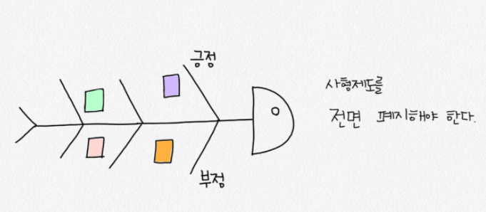
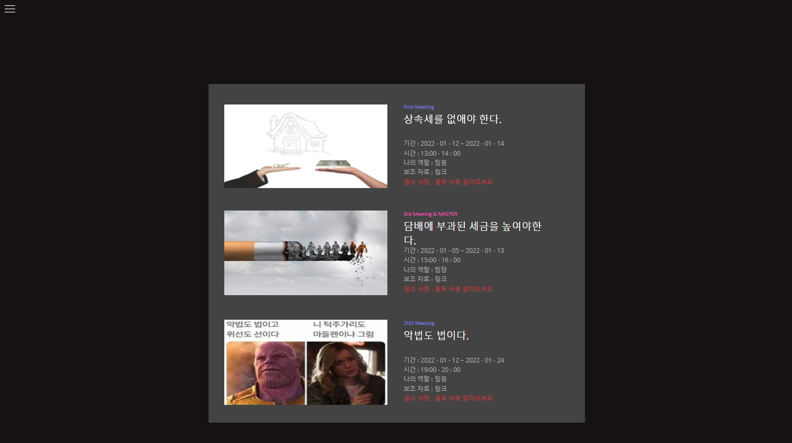
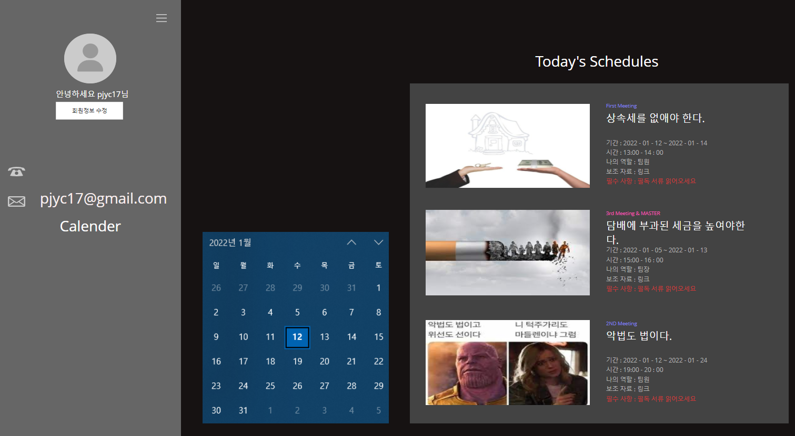

[CHOICE_HAT_2P.vp](readme.assets/CHOICE_HAT_2P.vp) -> 아이디어 해커톤때 만든 목업

### 시연후 들은 평가 : 

### 아이디어의 부족한 점, 보완이 필요한 측면, 보완점, 왜 보안이 필요한지

- 줌, 구글미트, 웹엑스와 다른 강점이 무엇일까요?

  <- 회의관련 기능을 직접적으로 제공한다는게 강점입니다. 지금은 6모자기법만 적용되었는데 다양한 회의기법을 적용할 수 있도록 한다면 충분히 경쟁력이 있다고 생각했습니다! 좋은 질문감사합니다ㅎㅎ

- 역할이 주어진다는데 해당 역할을 수행하는 데에 적절하지 않은 성격이면 오히려 역효과가 나는게 아닌지?

  <-역할을 바꿀 수 있는 기능도 생각해두기는 했습니다! 좋은 질문 감사합니다

- 모자가 6개인데 만약 미팅참여하는 인원이 6명 미만일 경우 역할배분은 어떻게 할지??(이상이면?)

  <- 한가지 회의 기법을 적용한 예이므로 인원에 맞춘 다양한 회의 기법을 적용할 수 있도록 한다면 해결될것같습니다.!! 좋은 질문 감사합니다~~

- 그럼 가장 강점으로 생각하는 기능은 6모자 기법인가요? <- 위질문에대한 답변으로 대신할 수있을것같습니다 피드백 감사합니다!!

### 아이디어의 흥미롭다고 생각되는 점, 독특한 점

- 화면을 켜면 모자를 쓰고 있는게 시각적으로 보이나요?? (보였으면 좋겠어요ㅎㅎ 2)
- 회의 기능을 질적으로 양적으로 잘 구현하는 것이 중요할듯-
- 다양한 기능이 추가될 수 있다는게 기대되네요!

---

# 01.10 토론 기법 정리 - 주윤

# **피시본 토의기법(fish-bone discussion)**

- **한줄 설명 : 일의 결과(특성)와 그것에 영향을 미치는 원인(요인)을 계통적으로 정리, 원인 규명을 쉽게 할 수 있도록 하는 원인분석기법**
- **머리 = 일의 결과 / 뼈 = 특성에 영향을 미치는 원인**

1. 생선 머리부분에토의해야할 주제를 적는다.
2. 생선 꼬리부분에 팀의 입장을 적는다.
3. 머리부터 꼬리로 가는 생선 뼈 부분에 주제에 대한 이유와 근거를 적는다.
4. 어느 정도 생선뼈(이유와 근거)들이 채워졌다면 함께 모여서 정리한다.

사용 사례 :

### **장점 :**

- 연령에 관계없이 접근이 쉽다.
- 그룹참여를 독려하고 프로세스에 대한 그룹지식을 활용한다.(집단지성)
- 그림을 그려가는 것 자체가 교육적 효과
- 원인에 대한 적극적 탐색 가능
- 머리를 먼저 정해서 토론의 주제(시작)이 눈에 잘 보임
- 어떤 주제에 관해서도 활용이 가능
- 토론 팀이 문제 설명과 관련된 원인 및 원인을 식별하는 시간을 줄여줌
- 제작의 입장에서 주제를 입력하게 하고 토론이 진행됨에 따라 뼈에 해당하는 내용들을 가시적으로 붙여줄 수 있을 듯

### **단점 :**

- 자료를 수집하여야하는 경우가 흔하다.
- 많은 원인과 문제들이 상호 연관되어있는 매우 복잡한 문제들에는 특별히 유용하지 않다.
- 이미지의 자유도를 높여주기 위한 코딩이 필수적...

긴 설명 :

https://slidesplayer.org/slide/16340954/

https://m.blog.naver.com/PostView.naver?isHttpsRedirect=true&blogId=ksk3007&logNo=30000358455

# **간단히 얘기하자면**

연령제한 x, 도식화로 가시성 높음, 복잡한 문제에는 적합하지 않다. 기업 경영전략 세울때 주로 사용

회의록 기능같이 구현한다면 매우 잘어울릴것 같은 기능

------

------

# **피라미드 토론기법**

- **한줄 설명 : 역피라미드 토론방식의 의견 수렴 및 합의 방식**

### 의사결정 토론 모형으로도 불리는 피라미드 토의 기법!!!

여러가지 대안 중 우선 순위를 뽑고자 할 때 사용된다. 의견과 의견이 더해져 주장에 대한 이유와 근거들이 합쳐가는 과정이 피라미드가 쌓이는 것과 닮아 붙여진 이름이다. 주의할 점은 설득당하지 않기 위해 자신의 의견에 대한 억지 주장을 펼치지 말아야하며, 본인이 상대방을 설득했다고 할지라도 상대방의 의견에서 좋은 점은 긍정적으로 검토하고 보완한다.

1. 모두가 세장의 종이를 받고 한장의 종이에 주제에 대한 자신의 의견을 적는다.
2. 입장이 다른 두 사람이 마주보고 앉아 각자 적은 의견을 말하면서 상대방을 설득한다.
3. 설득당한 사람은 설득한 사람과 한 팀이 되고 설득 과정에서 나온 상대방의 의견을 다른종이에 보충한다.
4. 팀의 의견이 보충되어 나오면 다른 팀과 1, 2 과정을 거친다.
5. 최종적으로 4: 4가 될때 까지 토론후 마지막으로 대표의견을 고른다.

### **장점 :**

- 다수의 인원이 모두 개인의 생각을 제시하며 모든 토론자가 참여 가능함(인원제한 X)
- 1:1로 의견을 수렴하고 합의해 가는 과정이 있기때문에 토론에 자동적으로 참여
- 각자의 리스트를 동일 분량으로 수렴하기 때문에 최선의 결과가 남을듯
- 토론기법자체가 차별적 기법인듯함.

### **단점 :**

- 토론의 길이가 다른 토론보다 길다.

- 나누어진 토론 방의 갯수가 많으리란 생각 -> 수렴한 의견데이터를 그대로 들고 상위 방으로

  이동시키는 복잡성

- 관리에 힘들것같다..

- 부전승 고려

### **긴설명 :**

https://m.blog.naver.com/PostView.naver?isHttpsRedirect=true&blogId=preaholy&logNo=120205512332

https://m.blog.naver.com/ksk3007/30000705200

# 간단히 말해서

인원제한없다!!! 시간이 오래걸리고 방의 소비가 많다(세부세션..구현..?), 그래도 토론 플랫폼인데 자동적으로 합의본 내용은 올라가게...구현 힘이 좀 들것같은디

난이도는 모르겠지만 좋은 기법같아 사용해보고 싶다.

---

# 01.12 (오전)페이지별 와이어 프레임 제작

#### 마이페이지 목업 제작

- 회원정보 & 회원의 미팅 정보 제공페이지
- 회원정보 수정 클릭시 화면 제작

 [MY_PAGE_V1.0.1.vp](readme.assets\MY_PAGE_V1.0.1.vp) 

---

#### 피드백 받은 schedule 추가 화면

좌측에 캘린더를 넣을때는 조금 작게 넣어주세요 반영

화면 구성으로는 현재 모습이 조금 나은듯 보임(내 의견)